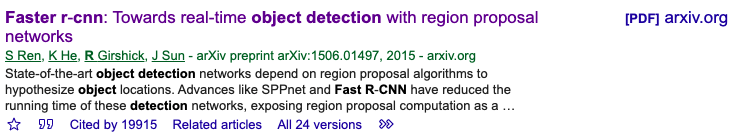

# What we can do? 

**So, What can we do for this project? ☻**

## Three Main areas

- Computer Vision 🐤
- NLP: Natural language processing 🐧
- Recomendation System 🐦

### Computer Vison

**What things can we do in computer Vision?**

> In fact, I can show you a demo right now.🤡
See in the github using fastai reference to the fastai course 2

1. Multi-Classfication for Image, Eg: Detected Wether it is a dog or cat
   - Pros: If we really want to do that, We can do it a really great by lots of data
   - Cons: probably, the most ezest thing for computer Vision. 
2. based on the Faster-Rcnn object detection
    - Faster-Rcnn is a framework posted by `S Ren`,`K He`, `R Girshick` and `J Sun` in 2015. The originally paper has been cited over 19915 times. Really good practice project. Good for the Future.

> What a brain fuck! 🙊 
> If we can do it successfully, we can all get into google or FANG🐣  (joke)

-------

#### Excited? Let's get deep into Faster-CNN!🦉

> **What is Faster-RCNN?**

> It is the most popular Object Detection Framework in the world. And it is not only an object decetion, it can do lots of things. It can be used for face detection. `小米最近用FAster-RCNN 把人脸检测精确度上升到了一个高精确的地步, 可以检测任何物体.` 

**And it is an open source project publiced on the github.**

First need to know,
- CNN is a kind of deep learning network(卷积神经网络)
- RCNN is a kind of an algorithm.

See here: https://zhuanlan.zhihu.com/p/23006190

### NLP 😃

**What can we do?**

- Sentiment Analysis 情感分析
    - Using LSTM (ez - mid)
`I have done Sentiment Analysis before, So if we rush on time, We can choose This.`

- Text Correct 文本纠错
  - EZ
  
- ChatBOT 我正在做

> BTW
> The things about NLP above are all Trash
> 我只是在讲干话

# HERE INTRODUCED TO YOU THE ONE, THE GREARTEST NLP MODLE AT ALL THE TIME 

# BERT😎

## SO What is BERT? 
BERT is a Pre-Training model by google and the paper about BERT has been cited over 16288 times.

It is the 
- NEWEST 
- EAZIST 
- COOLEST 

MODLE IN NLP! 

## Why Newest?

It was published in 2019 and it is the model for NLP right now.

## Why EAZIST?

First, The most diffcult part of Deep Learning is tuning the paremeters. It is hard and time consuming.

But, BERT as it is said and as it is ,it is a pre-training model. That means we don't need to tune the paremeters by ourself, the google have tuned for us. We just Need to add an output Layer. EZ🤩

Althought, We might meet some diffcults, But thanks to BERT it is an open source Model, once we have some problems, it is ez for us to search on google. 

## Why COOLEST?
Imaging that during the presentation, everyone is doing the basic deep learning project presentation. And we are using BERT which is a Model that every Reasch group and Industry are using right now. Other guys can not even understand.🧐

## Ok! BERT is good, SO what we can do using BERT?

Well, Here there are:

- Sentiment Analysis Based on BERT
  
- Named-entity recognition Based on BERT(命名实体识别)

 - WHat is Named-entity recognition?
   - 讲的时候说

## REC SYS

可以做, 但是没有必要

   

