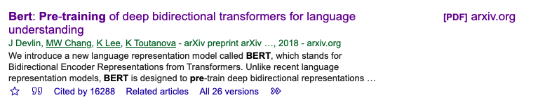

# AIDM7370 AI Theories and Applications Group Project

- Group Name: GKD 
    - Group Member: Chen Xiaoqi, Gu Yitong, Huang Delan, Luo Yifeng
- Project Title: Ner: Named-entity recognition based on BERT 

## Questions/ Objectives:
- Which issue/case/beat do you want to cover in this project?
- What is the 'Problem' you can identify?
- What is your Motivation and needs to do this project?

With the popularzation of computers and the wide application of various electronic texts, the mass of information has brought severe challenges to people's information acquisition, and people urgently need some automatic tools to help the mass information processing. Information extraction, information retrieval, machine translation, abstract generation and other technologies are generated under this background. A common but fundamental problem in these techniques is Naming EntityRecognition. Named entity recognition as a very important and essential key technology in these studies, more and more attention and attention, has been developed into an independent research branch, C0L - ING2002 has a special topic named entity recognition.

> Overall： 随着计算机的发展， 我们越来越需要 **命名实体识别** 这个工具。

---

## The data:

**We have found two dataset on Internet：**

1. **Annotated Corpus for Named Entity Recognition: Corpus for entity classification with enhanced and popular features by Natural Language Processing applied to the data set.**
    - https://www.kaggle.com/abhinavwalia95/entity-annotated-corpus
2. **CoNLL 2003: Dataset that contains 1,393 English news articles with annotated entities LOC (location), ORG (organization), PER (person) and MISC (miscellaneous)**
    - https://www.clips.uantwerpen.be/conll2003/ner/

> Both of these two datasets has been already collected and cleaned by us.
- See the github for more information: https://github.com/Andr3wis2Cool4School/AI-pro/blob/main/data%20av.ipynb

### The data description:

#### Annotated Corpus for Named Entity Recognition:
Open source dataset on kaggle, After some precleaning steps, we get the well-structured data and store them into a dataframe. 

Each row is a train example, 
and the tag means:

- geo = Geographical Entity
- org = Organization
- per = Person
- gpe = Geopolitical Entity
- tim = Time indicator
- art = Artifact
- eve = Event
- nat = Natural Phenomenon

#### CoNLL 2003 Dataset:

The data after cleaned is like this:

 | TOKENS | POS | CHUNK_TAG| NE|
 | --- |   ---  | --- | -- |   
 |U.N.        | NNP | I-NP | I-ORG |
 | official   | NN  | I-NP | O |
 | Ekeus   |     NNP | I-NP | I-PER |
 | heads  |      VBZ | I-VP | O |
 | for       |   IN |  I-PP | O| 
 | Baghdad  |    NNP | I-NP | I-LOC |
 |  .    |        .   | O  |   O |

 - Tokens : word in sentence
 - POS: part of speech(词性)
 - CHUNK_TAG: syntactic chunk tag(句法标记块)
 - NE：label

 >  from https://www.clips.uantwerpen.be/conll2003/ner/    The CoNLL-2003 shared task data files contain four columns separated by a single space. Each word has been put on a separate line and there is an empty line after each sentence. The first item on each line is a word, the second a part-of-speech (POS) tag, the third a syntactic chunk tag and the fourth the named entity tag. The chunk tags and the named entity tags have the format I-TYPE which means that the word is inside a phrase of type TYPE. Only if two phrases of the same type immediately follow each other, the first word of the second phrase will have tag B-TYPE to show that it starts a new phrase. A word with tag O is not part of a phrase.

 **We are having the difficulty of choosing what dataset we will use in the group project and we also considering of conbine both datasets together**

## Why use BERT?

BERT is a Pre-Training model by google and the paper has been cited over 16288 times, easy to both understand and use.

